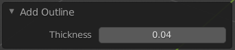
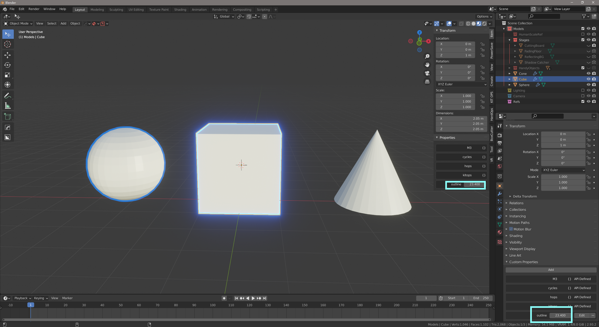

# Version 0.2
* Support Blender 2.93
* The thickness can be adjusted while adding the outline:

* Now the outline uses an emission shader, and the intensity cam be adjust via an object custom property (in the Properties -> Object -> Custom Properties panel).

 C'est-à-dire:
* The outline can glow;
* The outline can be turn off (by setting the "outline" custom property to 0.0);
* Outline emission strength can be adjusted per individual object, even they share a same outline material. You can turn on/off an outline of an object without affect other ones:

* Still works in eevee as well as cycles engine.