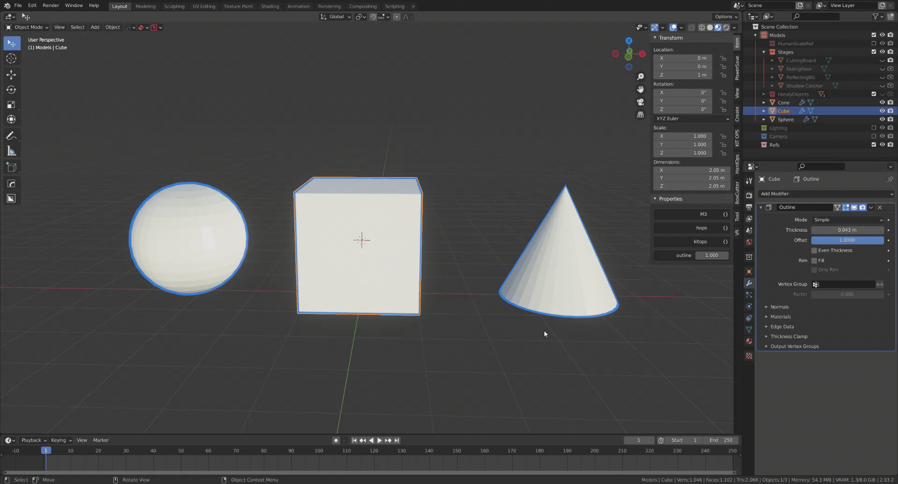

Add Outlines in Blender
======================

The addon allows you to add outlines in one click.

* Works with both Eevee and Cycles Engine;
* Outlines can glow or be cartoonish;
* Each object's outline's glow strength can be adjusted individually without creating dulipcated materials, by changing an object custom property. 

## How to

Edit -> Preferences -> Addon -> Install and select `add_outline.py`. After its installed,
enable it and in the addon settings select the path for `toon_outline.blend`.

After this, you can select multiple objects and go Object->Add Outline. 

The "glowing" of the outline can be adjusted via an object custom property named "outline".

## What does it do:

The addon will add a solidify modifier to an object with some additional settings.
Then it will add a material only to this solidified section. The material will be transparent
except for the edges which will show up as an outline.